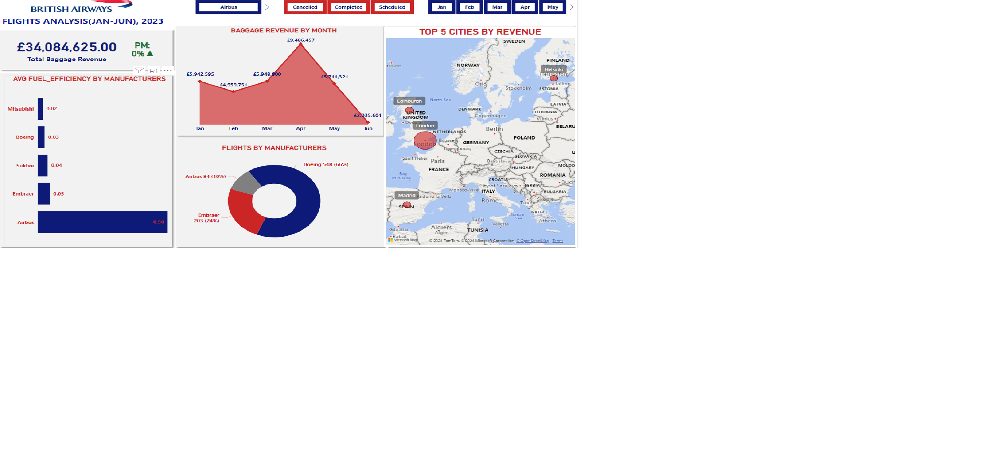
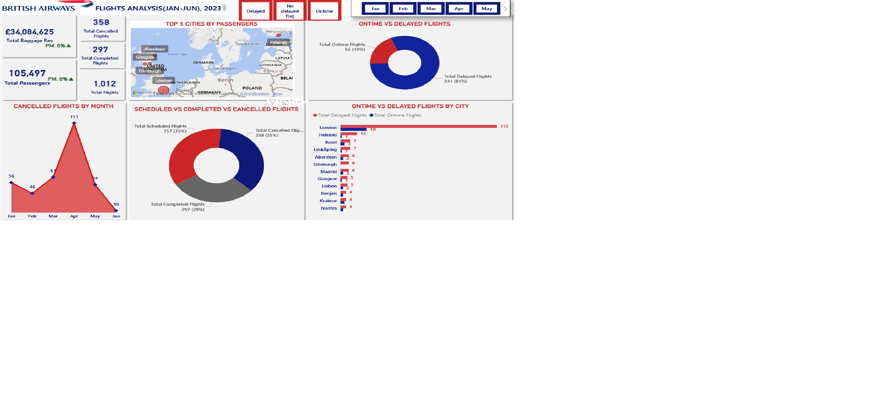

# British_Airways_Flight_Analysis

### Project Overview

This is British airways flight analysis for the first half of 2023 using Power Bi. 
It contains dashboards that analyses revenue and aircraft utilization during the said time.

---

### Objectives
This analysis aims at answering the following business questions:
1. What manufacturer has the best aircrafts in terms of fuel efficiency?
2. Does British airways tend to use aircraft from manufacturers known for their superior fuel efficiency more frequently?
3. Which month did passengers cancel flights the most?
4. Which city do passengers travel to the most?
5. What is the revenue generated from baggage overtime?
6. What is the average number of passengers like for each month?
---

### Data Source
The analysis utilizes data from [ba_flights_db_data](https://kaggle.com)

---

### Tools
- Microsoft Excel

- Sql

- Power Bi

---

### Skills Demonstrated
- Using Microsoft Excel, data was cleaned by removing duplicates and handling missing values.
- Using PostgresSql, tables were created,the cleaned data was imported and the analysis questions were answered.
- Using Power Bi, data model was created,dax measures written to make visualizations on the dashboard.

---

### Visualizations
This project

 What manufacturer has the best aircrafts in terms of fuel efficiency?

 

 Does British airways tend to use aircraft from manufacturers known for their superior fuel efficiency more frequently?

 

 Which month did passengers cancel flights the most?

  

  Which city do passengers travel to the most?

  

---

 ### Findings
 1. From this analysis, the manufacturer mitsubishi has the best aircraft in terms of fuel efficiency.
 2. During the first half of 2023, British airways used aircrafts from manufacturers with superior fuel efficiency more frequently.
 3. It was observed that passengers cancelled flights mostly in the month of April.
 4. Also, passengers travelled mostly to London during this time.
 5. A total baggage revenue of £34M was generated over time.

---

### Reccommendations
1. We can improve fuel efficiency by fleet modernization; investing in newer more fuel efficient aircrafts and phase out older less fuel efficient ones.
